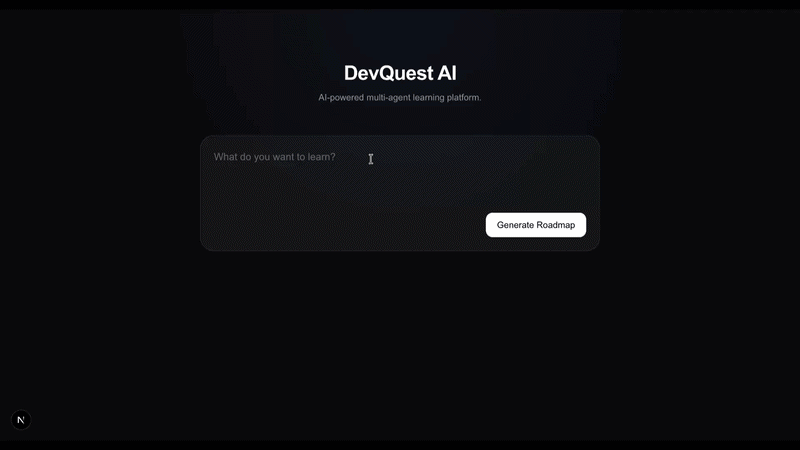
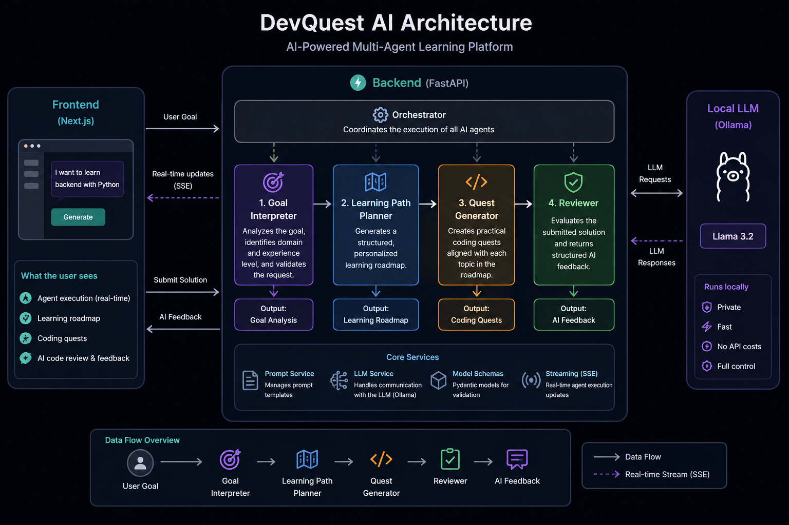

# DevQuest AI

An **AI-powered multi-agent** learning platform that generates personalized software engineering roadmaps, practical coding quests, and intelligent code reviews.

DevQuest AI leverages a modular AI agent architecture to transform a user's learning goal into a structured learning experience. **Specialized AI agents** collaborate to analyze the user's objective, generate a personalized roadmap, create project-based coding quests, and evaluate submitted solutions with structured AI feedback.

Powered locally by **Llama 3.2** through **Ollama**.

Built with **Next.js**, **FastAPI**, **TypeScript**, **Tailwind CSS**, and **Ollama**.

---


## Demo

<p align="center">
  
</p>

> DevQuest AI demonstrates how a team of specialized AI agents can collaborate to solve a complex task by decomposing it into focused responsibilities, resulting in a personalized and interactive software engineering learning experience.

## Features

- **Multi-Agent AI Architecture** with specialized agents.
- **Personalized Learning Roadmap Generation** tailored to software engineering goals.
- **Project-Based Coding Quest Generation** aligned with the generated learning roadmap.
- **AI-Powered Code Review** with structured feedback.
- **Real-Time Agent Execution** using Server-Sent Events (SSE).
- **Responsive User Interface** built with Next.js and Tailwind CSS.
- **Local LLM Inference** powered by Llama 3.2 via Ollama.
- **Modular FastAPI Backend Architecture**.

## Architecture

DevQuest AI follows a modular multi-agent architecture in which each AI agent is responsible for a single stage of the learning workflow.

The complete workflow is illustrated below.



The workflow begins when a user submits a learning goal through the frontend. The backend orchestrator sequentially executes four specialized AI agents:

1. **Goal Interpreter** analyzes and validates the user's objective.
2. **Learning Path Planner** generates a personalized learning roadmap.
3. **Quest Generator** creates practical coding quests aligned with the roadmap.
4. **Reviewer** evaluates submitted solutions and provides structured AI feedback, including a score, strengths, areas for improvement, and personalized recommendations.

### AI Agents

| Agent                     | Responsibility                                                                                                                                      |
| ------------------------- | --------------------------------------------------------------------------------------------------------------------------------------------------- |
| **Goal Interpreter**      | Analyzes the user's learning objective and validates whether the requested goal is supported.                                                       |
| **Learning Path Planner** | Generates a structured learning roadmap adapted to the user's goal and experience level.                                                            |
| **Quest Generator**       | Generates practical coding quests with appropriate difficulty levels (Beginner, Intermediate, or Advanced) based on the generated learning roadmap. |
| **Reviewer**              | Evaluates submitted solutions and returns structured feedback, strengths, suggested improvements, and a score.                                      |

## Tech Stack

| Category              | Technologies                             |
| --------------------- | ---------------------------------------- |
| **Frontend**          | Next.js, React, TypeScript, Tailwind CSS |
| **Backend**           | FastAPI, Python                          |
| **AI Framework**      | Custom Multi-Agent Architecture          |
| **LLM**               | Llama 3.2 (via Ollama)                   |
| **Communication**     | REST API, Server-Sent Events (SSE)       |
| **Development Tools** | uv, npm                                  |

## How It Works

1. **The user** enters a software engineering learning goal.

2. The **Goal Interpreter Agent** analyzes the request, identifies the target domain, experience level, and validates whether the goal is supported.

3. The **Learning Path Planner Agent** generates a personalized learning roadmap with progressively ordered topics.

4. The **Quest Generator Agent** creates practical coding quests aligned with the generated learning roadmap.

5. The user selects a quest and submits a solution.

6. The **Reviewer Agent** evaluates the submitted solution and returns structured AI feedback, including:
   - Overall score
   - Strengths
   - Areas for improvement
   - Personalized recommendations

## Project Structure

```text
devquest_ai/
│
├── app/                    # Next.js App Router pages
├── components/             # Reusable React components
├── services/               # Frontend API communication
├── types/                  # Shared TypeScript types
│
├── backend/
│   ├── agents/             # AI agents
│   ├── models/             # Pydantic models
│   ├── orchestrator/       # Multi-agent orchestration
│   ├── prompts/            # Prompt templates
│   ├── services/           # LLM and prompt services
│   └── main.py             # FastAPI application
│
├── package.json
└── README.md
```

### Directory Overview

| Directory               | Description                                                           |
| ----------------------- | --------------------------------------------------------------------- |
| `app/`                  | Next.js App Router pages and application entry point.                 |
| `components/`           | Reusable UI components used throughout the application.               |
| `services/`             | Frontend services responsible for communicating with the backend API. |
| `types/`                | Shared TypeScript interfaces and models.                              |
| `backend/agents/`       | AI agents responsible for the learning workflow.                      |
| `backend/models/`       | Pydantic models used for request and response validation.             |
| `backend/orchestrator/` | Coordinates the execution of all AI agents.                           |
| `backend/prompts/`      | Prompt templates used by each AI agent.                               |
| `backend/services/`     | Services for LLM interaction and prompt management.                   |

## API Endpoints

| Method | Endpoint                         | Description                                                                                                                                 |
| ------ | -------------------------------- | ------------------------------------------------------------------------------------------------------------------------------------------- |
| `GET`  | `/health`                        | Returns the current health status of the backend service.                                                                                   |
| `POST` | `/generate-learning-path`        | Generates a personalized learning roadmap and coding quests.                                                                                |
| `POST` | `/generate-learning-path-stream` | Streams the execution of each AI agent in real time using Server-Sent Events (SSE) while generating the learning roadmap and coding quests. |
| `POST` | `/review-solution`               | Reviews a submitted solution and returns structured AI feedback.                                                                            |

> **Note:** The frontend uses the `/generate-learning-path-stream` endpoint to visualize the execution of each AI agent in real time, while `/generate-learning-path` returns the final result as a single JSON response.

## Getting Started

### Prerequisites

Before running the project locally, make sure you have the following installed:

- Python 3.12+
- Node.js 20+
- uv
- Ollama

Download the required LLM:

```bash
ollama pull llama3.2
```

---

### Clone the Repository

```bash
git clone https://github.com/andref218/devquest_ai.git

cd devquest_ai
```

---

### Backend Setup

Navigate to the backend directory:

```bash
cd backend
```

Install the dependencies:

```bash
uv sync
```

Start the FastAPI server:

```bash
uv run uvicorn main:app --reload
```

The backend will be available at:

```
http://localhost:8000
```

---

### Frontend Setup

Return to the project root:

```bash
cd ..
```

Install the frontend dependencies:

```bash
npm install
```

Start the development server:

```bash
npm run dev
```

The frontend will be available at:

```
http://localhost:3000
```

## Future Improvements

Potential future enhancements include:

- User authentication and personalized profiles.
- Progress tracking across completed learning paths.
- Learning resource recommendations for each roadmap topic.
- Support for multiple LLM providers (OpenAI, Anthropic, Gemini, etc.).
- Adaptive quest generation based on previous performance.
- Roadmap export to PDF or Markdown.

# Author

**André Fonseca**

- GitHub: https://github.com/andref218
- Hugging Face: https://huggingface.co/andref218

# License

This project is licensed under the MIT License.
